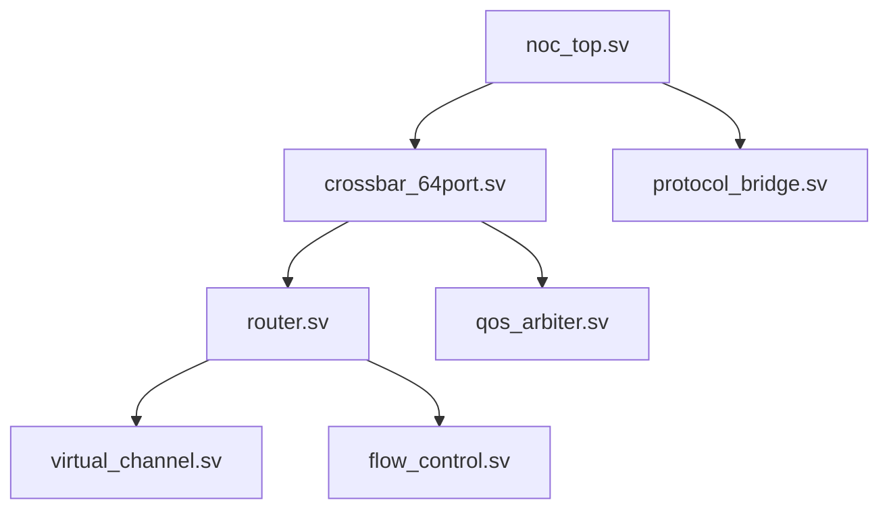

# NoC Feature List

| 项目 | 内容 |
|------|------|
| 模块名称 | Network-on-Chip (NoC) Interconnect |
| 版本 | V1.0 |
| 创建日期 | 2026-01-19 |
| 状态 | RTL Development |
| 架构来源 | 02_Architecture/05_NoC_Interconnect_Architecture.md |

---

## 1. 顶层规格

### 1.1 设计目标

| 指标 | 目标值 | 实现状态 |
|------|--------|----------|
| **峰值带宽** | ≥ 500 GB/s | TO DO |
| **延迟** | ≤ 20 cycles | TO DO |
| **频率** | 2.0 GHz | TO DO |
| **能效** | ≤ 2 pJ/bit | TO DO |
| **面积** | ≤ 8 mm² | TO DO |
| **功耗** | ≤ 3W | TO DO |

### 1.2 拓扑结构

- **全局互联**: 64x64 Crossbar Switch (512-bit)
- **局部互联**: 2D Mesh (CPU集群内部)
- **容错路径**: 环形网络

### 1.3 端口分配 (64 Ports)

| 端口号 | Master/Slave | 带宽需求 | 优先级 | 协议 |
|--------|--------------|----------|--------|------|
| 0-7 | 8x Cortex-A78AE (ACE) | 64 GB/s | 高 | ACE |
| 8-9 | 2x Cortex-R52 (AXI) | 32 GB/s | 高(安全) | AXI |
| 10-13 | 4x NPU Cluster (AXI) | 200 GB/s | 高 | AXI |
| 14-15 | GPU Cluster (AXI) | 64 GB/s | 中 | AXI |
| 16-17 | ISP (AXI) | 32 GB/s | 中 | AXI |
| 18 | LPDDR5 MC (AXI) | 200 GB/s | 高 | AXI |
| 19 | L3 Cache (ACE) | 128 GB/s | 高 | ACE |
| 20-23 | PCIe Controller (AXI) | 32 GB/s | 中 | AXI |
| 24-25 | Ethernet (AXI) | 16 GB/s | 低 | AXI |
| 26-27 | USB (AXI) | 16 GB/s | 低 | AXI |
| 28-31 | 其他外设 (APB) | 2 GB/s | 低 | AXI |

---

## 2. Crossbar Switch (noc_top.sv)

### 2.1 规格

| 参数 | 规格 |
|------|------|
| 端口数 | 64 |
| 数据位宽 | 512-bit |
| 频率 | 2.0 GHz |
| 峰值带宽 | 512 GB/s |
| 交换方式 | 虚拟通道 (VC) 交换 |
| 仲裁方式 | 轮询 + 优先级仲裁 |
| 缓冲深度 | 64 flits/端口 |
| VC数量 | 4 VCs/端口 |

### 2.2 接口信号

```systemverilog
// 时钟复位
input  wire                 clk,
input  wire                 rst_n,

// 64个输入端口 (每个端口 512-bit)
input  wire [63:0]          vc_valid_in [0:63],
input  wire [511:0]         vc_data_in  [0:63],
input  wire [3:0]           vc_id_in    [0:63],
input  wire [1:0]           vc_prio_in  [0:63],

// 64个输出端口 (每个端口 512-bit)
output wire [63:0]          vc_valid_out [0:63],
output wire [511:0]         vc_data_out  [0:63],
output wire [3:0]           vc_id_out    [0:63],
output wire [1:0]           vc_prio_out  [0:63],

// 状态信号
output wire [63:0]          port_busy,
output wire [255:0]         vc_credits
```

### 2.3 功能特性

- [ ] 64x64 全连接 Crossbar
- [ ] 分布式仲裁器 (64请求者)
- [ ] VC Allocator (64x64)
- [ ] 优先级编码支持
- [ ] Credit-based 流量控制
- [ ] 死锁检测与恢复
- [ ] 时钟门控支持
- [ ] 电源门控支持

---

## 3. Router (router.sv)

### 3.1 规格

| 参数 | 规格 |
|------|------|
| 端口数 | 5 (North/South/East/West/Local) |
| 虚拟通道 | 4 VCs/端口 |
| 缓冲深度 | 16 flits/VC |
| 路由算法 | XY路由 / 完全自适应 |
| 流水级数 | 3级 |

### 3.2 接口信号

```systemverilog
// 时钟复位
input  wire                 clk,
input  wire                 rst_n,

// 本地端口
input  wire [511:0]         local_data_in,
input  wire                 local_valid_in,
output wire                 local_ready_out,

// 四个方向端口
input  wire [511:0]         ns_data_in,    // North-South
input  wire                 ns_valid_in,
output wire                 ns_ready_out,

input  wire [511:0]         ew_data_in,    // East-West
input  wire                 ew_valid_in,
output wire                 ew_ready_out,

// QoS 信号
input  wire [1:0]           qos_priority,
output wire [7:0]           congestion_status
```

### 3.3 功能特性

- [ ] 输入虚拟通道分配
- [ ] 输出端口分配
- [ ] 路由计算 (XY/自适应)
- [ ] 优先级仲裁
- [ ] 拥塞状态报告
- [ ] 流量整形

---

## 4. Virtual Channel (virtual_channel.sv)

### 4.1 规格

| 参数 | 规格 |
|------|------|
| VC数量 | 4/端口 |
| 缓冲深度 | 16 flits/VC |
| 数据位宽 | 512-bit |
| 分配策略 | 轮询 / 优先级 |

### 4.2 VC配置

| VC编号 | 优先级 | 流量类别 | 服务质量 |
|--------|--------|----------|----------|
| VC0 | 最高 | 安全关键流量 | 确定性延迟 |
| VC1 | 高 | 实时流量 | 低延迟 |
| VC2 | 中 | 大块数据传输 | 高吞吐 |
| VC3 | 低 | 尽力而为 | 背景流量 |

### 4.3 功能特性

- [ ] 独立 VC 缓冲
- [ ] VC 状态跟踪 (空闲/分配/使用)
- [ ] 优先级解码
- [ ] Credit 回传
- [ ] 死锁避免 (VC分配策略)
- [ ] 流量类别映射

---

## 5. Flow Control (flow_control.sv)

### 5.1 流量控制类型

| 类型 | 实现 | 优势 |
|------|------|------|
| Credit-based | 端到端信用 | 无死锁 |
| Pause Frame | 链路级暂停 | 简单实现 |
| 优先级流控 | VC 独立控制 | QoS 保证 |

### 5.2 功能特性

- [ ] Credit 计数器管理
- [ ] Pause Frame 生成/解析
- [ ] VC 独立流控
- [ ] 背压传播
- [ ] 零数据抑制
- [ ] 链路错误检测

---

## 6. QoS Arbiter (qos_arbiter.sv)

### 6.1 仲裁策略

| 策略 | 适用场景 | 说明 |
|------|----------|------|
| 轮询仲裁 | 同优先级请求 | 公平性保证 |
| 固定优先级 | 不同优先级 | 低延迟响应 |
| 加权轮询 | 差异化服务 | 带宽分配 |
| 最快路径 | 低延迟需求 | 最短路径优先 |

### 6.2 QoS机制

| 机制 | 实现 | 效果 |
|------|------|------|
| 优先级队列 | 4级优先级 | 差异化延迟 |
| 带宽保证 | Token Bucket | 带宽分配 |
| 延迟上限 | Latency Budget | 确定性延迟 |
| 流量整形 | Rate Limiter | 流量平滑 |

### 6.3 功能特性

- [ ] 4级优先级仲裁
- [ ] Token Bucket 带宽管理
- [ ] Rate Limiter 实现
- [ ] Latency Budget 监控
- [ ] 加权轮询调度
- [ ] QoS 配置寄存器

---

## 7. Protocol Bridge (protocol_bridge.sv)

### 7.1 支持协议

| 协议 | 主/从 | 支持特性 |
|------|-------|----------|
| **AXI4** | Master/Slave | Outstanding, Out-of-order, QoS |
| **AXI4-Lite** | Master/Slave | 简单事务 |
| **ACE** | Master/Slave | Snoop, DVM, Barriers |
| **CHI** | RN/FN | 一致性, 原子操作 |

### 7.2 功能特性

- [ ] AXI4/AXI4-Lite 协议转换
- [ ] ACE 协议支持 (Snoop Filter 接口)
- [ ] CHI 协议转换
- [ ] 协议适配层 (Packetization)
- [ ] 事务拆分/重组
- [ ] 错误注入/检测

---

## 8. 验证要求

### 8.1 DV准入标准

| 验证项 | 目标 | 状态 |
|--------|------|------|
| 代码覆盖率 | 100% | TO DO |
| 功能覆盖率 | 100% | TO DO |
| 断言覆盖率 | 100% | TO DO |
| 协议检查 | 100% | TO DO |

### 8.2 验证用例类别

| 类别 | 用例数 | 优先级 |
|------|--------|--------|
| 协议测试 | 200+ | P0 |
| 功能测试 | 300+ | P0 |
| QoS测试 | 100+ | P1 |
| 压力测试 | 50+ | P1 |
| 异常测试 | 100+ | P2 |

---

## 9. SDC约束

### 9.1 时钟定义

```tcl
# 主时钟
create_clock -name clk -period 0.5 [get_ports clk]

# 时钟不确定性
set_clock_uncertainty -rise_to_fall 0.05 [get_clocks clk]
set_clock_uncertainty -fall_to_rise 0.05 [get_clocks clk]
```

### 9.2 IO约束

| 端口 | 延迟 (ns) | 说明 |
|------|-----------|------|
| 输入数据 | 0.5 | Setup/Hold |
| 输出数据 | 0.5 | Clock-to-Out |

### 9.3 面积/功耗目标

| 指标 | 目标值 |
|------|--------|
| 面积 | ≤ 8 mm² |
| 动态功耗 | ≤ 2.7 W |
| 静态功耗 | ≤ 0.75 W |

---

## 10. 交付清单

| 文件 | 状态 |
|------|------|
| FEATURE_LIST.md | DONE |
| noc_top.sv | DONE |
| crossbar_64port.sv | DONE |
| router.sv | DONE |
| virtual_channel.sv | DONE |
| flow_control.sv | DONE |
| qos_arbiter.sv | DONE |
| protocol_bridge.sv | DONE |
| noc.sdc | DONE |
| noc_tb.sv (DV交付) | TO DO |

---

## 11. 依赖关系



---

**文档版本**: V1.0  
**最后更新**: 2026-01-19  
**状态**: RTL Development Started
